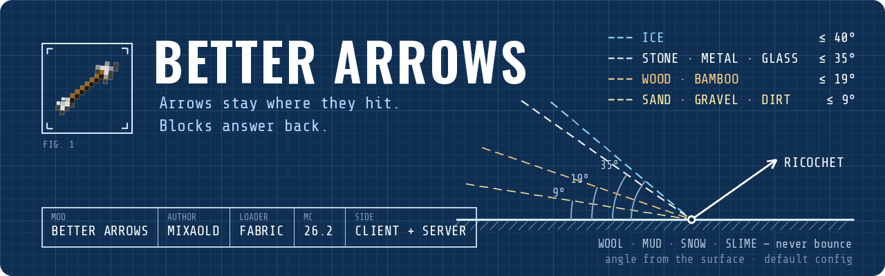

<p align="center">
  
</p>

<p align="center">
  <a href="https://modrinth.com/mod/betterarrows-mixaold"></a>
  <a href="https://github.com/Mixaold/BetterArrows/issues"></a>
  <a href="https://www.donationalerts.com/r/mixaold"></a>
</p>

<p align="center">
  
  
  
  
</p>

<p align="center"><b>English</b> · <a href="#русский">Русский</a></p>

---

## About

Arrows stay where they hit, stuck in whatever body part they went into — they swing with the arm,
bend with the leg. Vanilla just counts how many arrows are in you and re-rolls a random spot on a
random body part every single frame: you nail a zombie in the head, and the arrow turns up in its
leg. And on mobs vanilla doesn't draw them at all.

Works on players and on any mob, including mobs from other mods. Rejoin and the arrows are still
there, and other players see them too.

## Blocks answer back

What you shoot at matters too. The steeper the hit, the more speed stays in the block. Every material
has its own hit sound and its own spray of debris.

| What you shoot | What happens |
|---|---|
| Stone, metal, glass, deepslate | Skips off, even from a fairly straight hit |
| Wood, bamboo, ladders | Skips off too, but you have to shoot flatter |
| Sand, gravel, dirt | Only if it came in razor flat — any straighter and it's swallowed |
| Wool, mud, snow, slime, cobweb | Never bounces, the arrow just sticks |
| Ice | Doesn't bounce — slides along and slowly stops |
| Leaves | Like vanilla: the arrow just stands in them |

The angles on the banner are the default windows, measured from the surface: a ricochet is allowed up
to 35° on stone, about 19° on wood and about 9° on sand; an arrow slides on ice up to 40°.

Each part can be switched off on its own: **Mod Menu → Better Arrows**.

## Install

Needs [Fabric API](https://modrinth.com/mod/fabric-api) and
[Cloth Config](https://modrinth.com/mod/cloth-config). [Mod Menu](https://modrinth.com/mod/modmenu)
is optional — it just adds the settings button.

Put the jar on **both the client and the server**, same version on both sides: the client draws the
arrows, the server decides where they landed and whether they bounced. Nothing crashes if the versions
differ — the mod just quietly does nothing. If a friend sees no arrows, they've got a different version.

## Build

```
./gradlew build
```

The jar lands in `build/libs/` — the plain one, not `-sources`.

## License

[MIT](LICENSE). Mobs getting visible stuck arrows at all was first done by
[Arrow In The Knee](https://modrinth.com/mod/aitk), with vanilla's random placement; this one tracks
the real hit point.

---

<p align="center"><a href="#about">English</a> · <b>Русский</b></p>

## Русский

### О моде

Стрела торчит там, куда воткнулась, и держится за ту часть тела, в которую вошла: рука дёрнулась —
стрела с ней, нога согнулась — и стрела гнётся. А ваниль помнит только, сколько стрел в цели, и
каждый кадр заново кидает кубик: случайное место на случайной части тела. Всадил зомби в голову —
глядь, стрела в ноге. А на мобах ваниль их и вовсе не рисует.

Работает на игроках и на любых мобах, хоть из других модов. Перезашёл — стрелы на месте, и другие
игроки их тоже видят.

### Блоки отвечают

Важно и то, во что ты стреляешь. Чем прямее попал, тем сильнее стрела вязнет в блоке. У каждого
материала свой звук удара и своя крошка.

| По чему стреляешь | Что будет |
|---|---|
| Камень, металл, стекло, глубинный сланец | Отскочит, даже если попал довольно прямо |
| Дерево, бамбук, лестницы | Тоже отскочит, но стрелять надо ровнее |
| Песок, гравий, земля | Отскочит, только если прошла впритирку. Чуть прямее — проглотит |
| Шерсть, грязь, снег, слизь, паутина | Не отскакивает никогда, стрела просто втыкается |
| Лёд | Не отскакивает, а едет по льду и постепенно тормозит |
| Листва | Как в обычной игре: стрела торчит в листьях |

Углы на баннере — стандартные значения, отсчитываются от поверхности: рикошет от камня — до 35°, от
дерева — примерно до 19°, от песка — примерно до 9°; по льду стрела едет при угле до 40°.

Каждую часть можно выключить отдельно: **Mod Menu → Better Arrows**.

### Установка

Нужны [Fabric API](https://modrinth.com/mod/fabric-api) и
[Cloth Config](https://modrinth.com/mod/cloth-config). [Mod Menu](https://modrinth.com/mod/modmenu)
по желанию — он только добавляет кнопку настроек.

Ставить jar **и на клиент, и на сервер**, одной и той же версии: клиент рисует стрелы, сервер решает,
куда они попали и отскочили ли. Если версии разные, ничего не упадёт — мод просто молча ничего не
сделает. Если друг не видит стрел, у него другая версия.

### Сборка

```
./gradlew build
```

Готовый jar появится в `build/libs/` — обычный, не `-sources`.

### Лицензия

[MIT](LICENSE). Видимыми на мобах застрявшие стрелы первым сделал
[Arrow In The Knee](https://modrinth.com/mod/aitk), со случайным расположением из ванили; этот
отслеживает реальную точку попадания.
